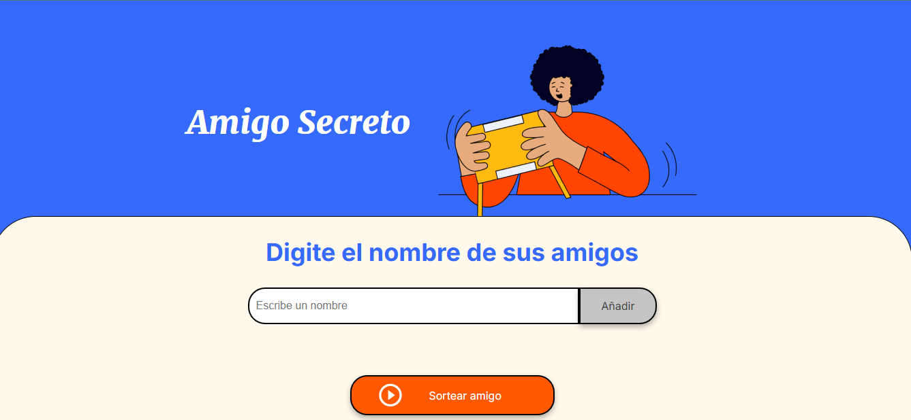

<h1>Amigo_Secreto_G8</h1> 
<h2>Juego Secreto 🎲</h2>

<p>Juego Secreto es una aplicación simple que permite a los usuarios ingresar nombres manualmente. Luego, los nombres se almacenan en una lista y se realiza un sorteo para seleccionar un ganador al azar. Ideal para juegos como el "Amigo Secreto".</p> 

<h2>Funcionalidades ✨</h2>

- Ingreso manual de nombres.
- Almacenamiento de nombres en una lista.
- Realización de un sorteo aleatorio para elegir al ganador.

<h2>Tecnologías utilizadas 🖥️</h2>

Este proyecto fue desarrollado utilizando las siguientes tecnologías:

- **HTML**: Para la estructura del sitio web.
- **CSS**: Para los estilos y diseño.
- **JavaScript**: Para la lógica del sorteo y manejo de la lista de nombres.

## Imágenes 📸

Aquí tienes una captura de la aplicación en funcionamiento:



<h2>Cómo ejecutar el proyecto 🚀</h2>

1. Clona el repositorio en tu máquina local:
    ```bash
    git clone https://github.com/KarlaV30/Amigo_Secreto_G8.git
    ```

2. Abre el archivo `index.html` en tu navegador favorito.

3. ¡Listo! Ahora puedes ingresar los nombres y realizar el sorteo.


